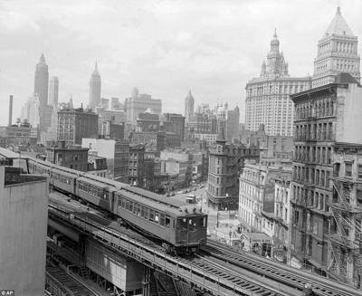

## [From Face to Natural Image: Learning Real Degradation for Blind Image Super-Resolution](https://arxiv.org/pdf/2210.00752.pdf)

[Xiaoming Li](https://csxmli2016.github.io/), [Chaofeng Chen](https://chaofengc.github.io), Xianhui Lin, [Wangmeng Zuo](https://scholar.google.com/citations?hl=en&user=rUOpCEYAAAAJ&view_op=list_works), [Lei Zhang](https://scholar.google.com/citations?user=tAK5l1IAAAAJ)

<a href="https://arxiv.org/pdf/2210.00752.pdf" target="_blank"></a>
<a href="https://colab.research.google.com/drive/1DbpzonpYGYhemYicrsayPSyDrzcYfoOX?usp=sharing" target="_blank"></a> 
<a href="https://creativecommons.org/licenses/by-nc-sa/4.0/" target="_blank"></a>

<p align="justify">How to design proper training pairs is critical for super-resolving real-world low-quality (LQ) images, which suffers from the difficulties in either acquiring paired ground-truth high-quality (HQ) images or synthesizing photo-realistic degraded LQ observations. Recent works mainly focus on modeling the degradation with handcrafted or estimated degradation parameters, which are however incapable to model complicated real-world degradation types, resulting in limited quality improvement. Notably, LQ face images, which may have the same degradation process as natural images (see the following Figure), can be robustly restored with photo-realistic textures by exploiting their strong structural priors. This motivates us to use the real-world LQ face images and their restored HQ counterparts to model the complex real-world degradation (namely ReDegNet), and then transfer it to HQ natural images to synthesize their realistic LQ counterparts. By taking these paired HQ-LQ face images as inputs to explicitly predict the degradation-aware and content-independent representations, we could control the degraded image generation, and subsequently transfer these degradation representations from face to natural images to synthesize the degraded LQ natural images. </p>


## Overview of our ReDegNet


## Getting Start

```
git clone https://github.com/csxmli2016/ReDegNet
cd ReDegNet
conda create -n redeg python=3.8 -y
conda activate redeg
python setup.py develop
```

## Pre-train Models
Download from the following url and put them into ./experiments/weights/
- [BaiduNetDisk](https://pan.baidu.com/s/1TZrB5bX-Ly_ovL8YvgHBcg?pwd=xat2)
or
- [GoogleDrive](https://drive.google.com/drive/folders/1J3yUjhTrVYMMvb3O3BKqtPS6E7FotPqc?usp=sharing)


## Training
> ###### As for the real-world LQ and Pseudo HQ face pairs, you can use any robust blind face restoration methods (e.g., [GPEN](https://github.com/yangxy/GPEN), [GFPGAN](https://github.com/TencentARC/GFPGAN), and [VQFR](https://github.com/TencentARC/VQFR))
Prepare the training data (see examples in TrainData and options/train_redeg.yml), and
```
CUDA_VISIBLE_DEVICES=0,1,2,3 python -m torch.distributed.launch --nproc_per_node=4 redeg/train.py -opt options/train_redeg.yml --launcher pytorch
```
or
```
CUDA_VISIBLE_DEVICES=0 python redeg/train.py -opt options/train_redeg.yml
```

See the training results through tensorboard
```
tensorboard --logdir tb_logger --port 7007
```

## Quick Inference of F2N-ESRGAN 
> #### we prepare two models, one is specifically fine-tuned for Figure 1 but may easily have artifacts on other test images, and the other is stable and not severely overfitted to this degradation (see the comments in test_restoration.py).
```
cd CleanTest
CUDA_VISIBLE_DEVICES=0 python test_restoration.py 
```

### Some Restoration Results
<div style='font-size:0'>
 
 
 
 
 
</div>

## Synthetic Degradation Examples of ReDegNet
```
cd CleanTest
CUDA_VISIBLE_DEVICES=0 python test_degradation.py 
```

## Acknowledgement
This project is built based on the excellent [BasicSR](https://github.com/XPixelGroup/BasicSR) and [KAIR](https://github.com/cszn/KAIR).


## Citation

```
@InProceedings{Li_2022_ReDegNet,
author = {Li, Xiaoming and Chen, Chaofeng and Lin, Xianhui and Zuo, Wangmeng and Zhang, Lei},
title = {From Face to Natural Image: Learning Real Degradation for Blind Image Super-Resolution},
booktitle = {ECCV},
year = {2022}
}
```

<a rel="license" href="http://creativecommons.org/licenses/by-nc-sa/4.0/"></a><br />This work is licensed under a <a rel="license" href="http://creativecommons.org/licenses/by-nc-sa/4.0/">Creative Commons Attribution-NonCommercial-ShareAlike 4.0 International License</a>.

